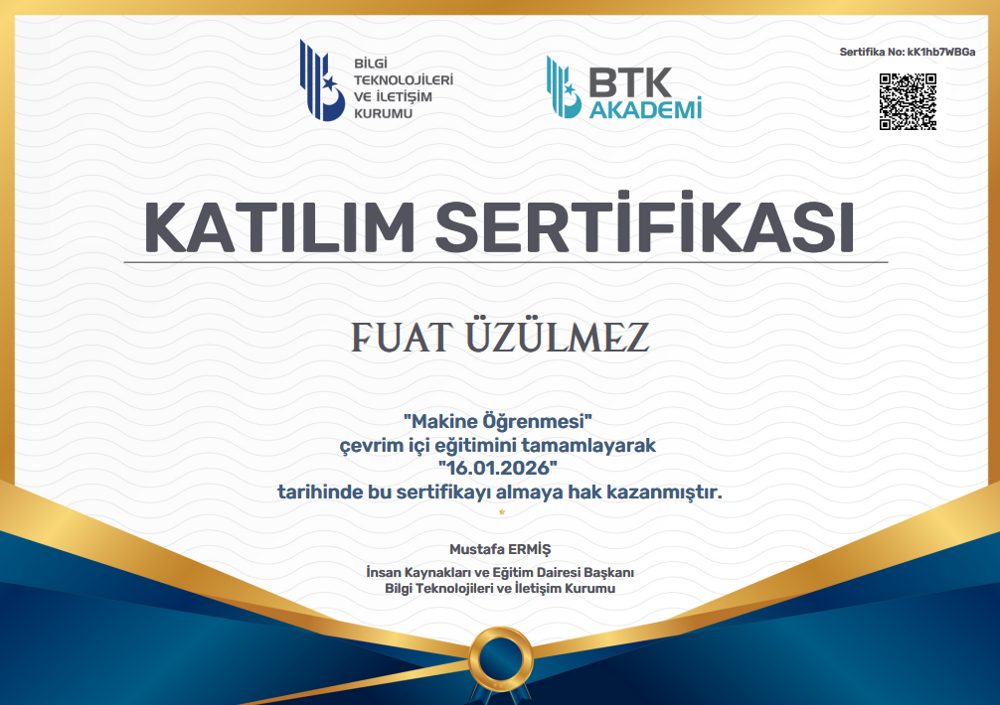
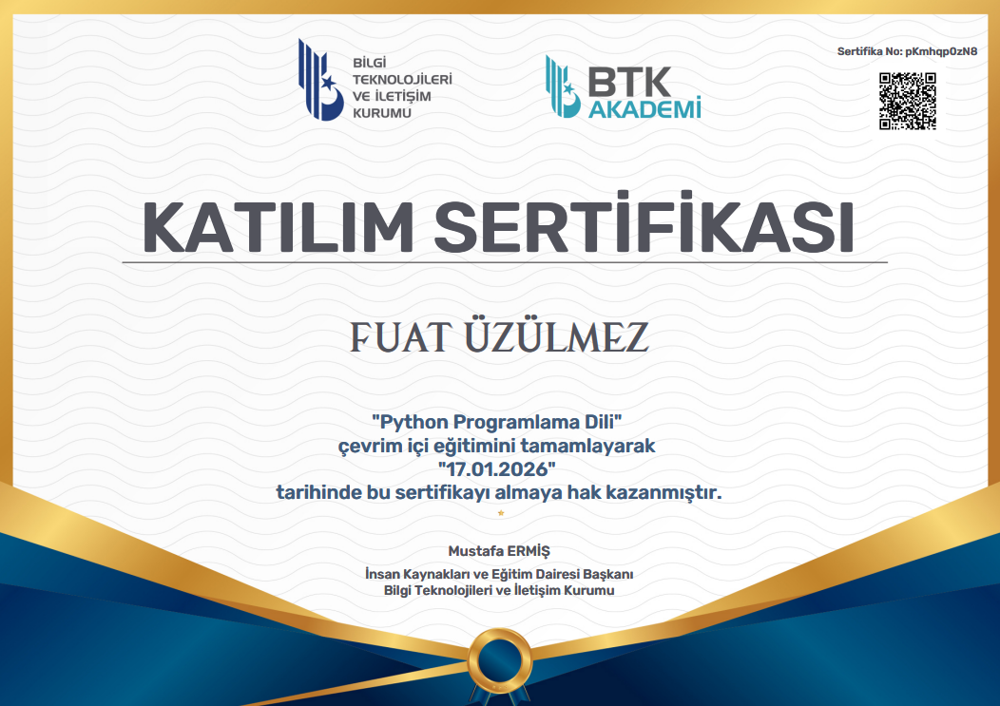
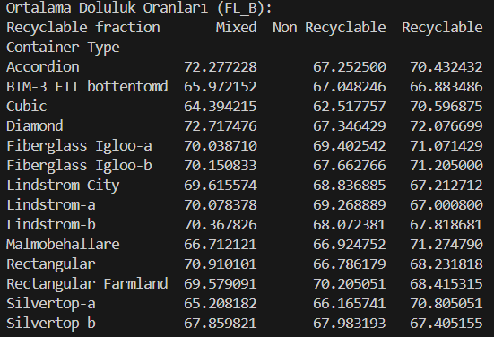
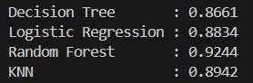
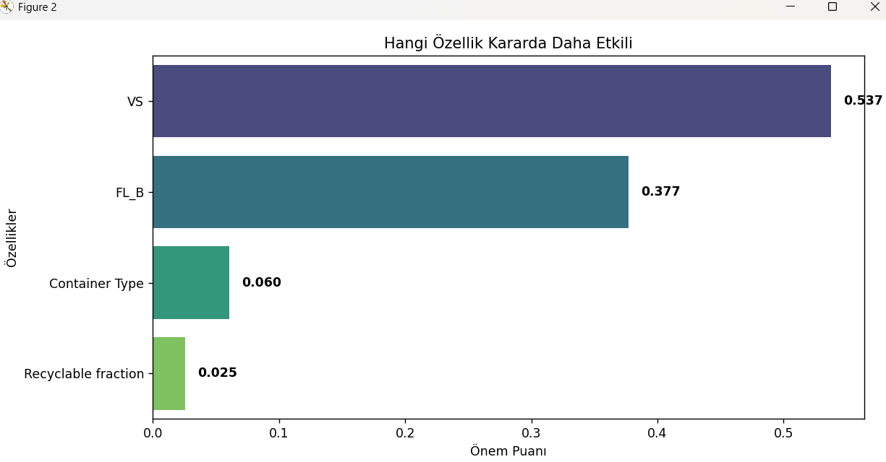
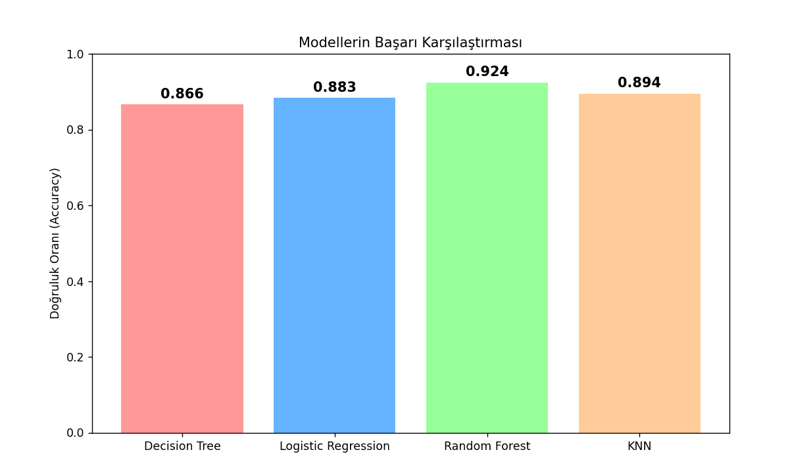

# Smart-Bin-ML-Analysis

## Sertifikalarım 
### Makine Öğrenmesi

## Python 

# Smart Bin ML Analysis

Bu proje, akıllı çöp kutularınndan elde edilen sensör verilerini kulanarak atık toplama süreçlerini optimize etmeyi amaçlayan bir makina öğrenmesi çalışmasıdır.

##  features
Projede kullanılan veri setindeki hedef değişken ve model eğitiminde kullanılan özellikler şunlardır:

* **hedef değisken :** Class
* **Features:**
    * FL_B : Boşaltma işlemi öncesindeki doluluk oranı.
    * VS: Sensör/Araç verisi.
    * Container Type: Konteynerin tipi
    * Recyclable fraction: Atığın geri dönüştürülebilirlik durumu 

---

## Pivot tablo
Konteyner tiplerine ve atık türlerine göre ortalama doluluk oranlarını (FL_B) incelemek için pivot tablosu oluşturulsmuştur. Hangi konteynerin hangi atık türünde daha hızlı dolduğu bu analizle gözlemlenmişitir.

---

## Kullanılan Modeller 
Projede farklı makine öğrenmesi algoritmaları denenmiş ve başarı oranları karşılaştırılmıştır. Kullanılan modeller:

1.  **Random Forest Classifier** (en başarılı modelimiz bu)
2.  **K-Nearest Neighbors (KNN)**
3.  **Logistic Regression**
4.  **Decision Tree**

Modellerin doğruluk oranları:

---

##  Sonuc 

Bu projede, akıllı atık yönetimi sürecini gelistirmek amacıyla features üzerinden makine öğrenmesi tabanlı bir tahmin sistemi geliştirilmiştir. Yapılan analizler sonucunda elde edilen temel çıkarımlar şunlardır:

1.  En Başarılı Model: Karmaşık verilerde genelde daha kararlı sonuçlar veren Random Forest algoritması, %92.4 doğruluk oranı ile bu problem için en uygun model oldu.
2.  Veri Odaklı Karar: Feature analizi, bir çöpün boşaltılması gerekip gerekmediğine karar verirken en kritik faktörün beklendiği üzere FL_B olduğunu, ancak diğer faktörlerin de modelin hassasiyetini artırdığını göstermiştir.

##  Grafikler

### 1. Özellik önem seviyleri
Random Forest modeli kullanılarak, kararı en çok etkileyen faktörler belirlenmiştir. Beklendiği üzere FL_B en belirleyici faktördür.

### 2. Model Başarı Karşılaştırıması
Eğitilen 4 farklı modelin başarı oranlarının karşılaştırmalı grafiği aşağıdadır. Random Forest modeli, veri setindeki karmaşıklığı en iyi çözümleyen algoritma oldu.

---
